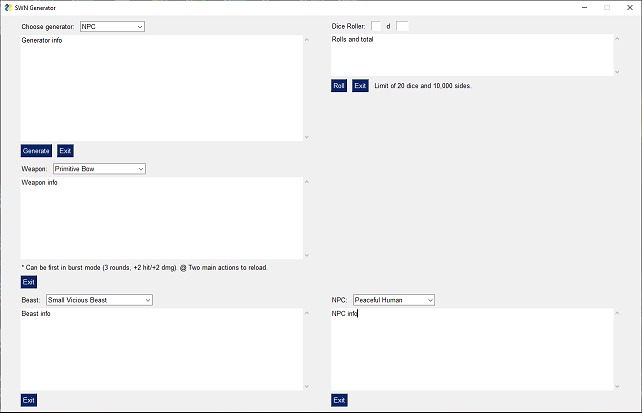

# SWN Generators
A small set of generators for Stars Without Number Revised Edition. 12/29/2017 Edition.

Mainly made as a test to see if I could do it. I wanted originally to just have CLI scripts, but after finding the amazingly wonderful [PySimpleGUI](https://github.com/PySimpleGUI/PySimpleGUI) I decided to lump it all in to a GUI program. Jury is still out on whether or not that was a good decision, since I am the worst at UX. Just look at it. Ugh.



This should be cross-platform, but I have yet to test it on anything other than Windows. I have included a standalone .exe, as the installation procedure as it stands leaves a lot to be desired as an end user. If you don't trust it, [do it yourself](https://pysimplegui.readthedocs.io/#creating-a-windows-exe-file). I don't blame you! 

## Installation

To install, you first need to install [Python 3.6+](https://www.python.org/downloads/). Download an install whichever version your computer needs. Linux users should have it pre-installed, but ```python3``` might not be up-to-date.

Second, you need to install [PySimpleGUI](https://github.com/PySimpleGUI/PySimpleGUI):

```pip install --upgrade PySimpleGUI```

or

```pip3 install --upgrade PySimpleGUI```

That should be run from command line. Windows users may need to preface the command with ```py -m```, assuming you selected that option during installation:

```py -m pip install --upgrade PySimpleGUI```

If ```py``` does not work, then you'll need to find where Python was installed and run the command there:

```python -m pip install --upgrade PySimpleGUI```

Windows users may also need to run the command prompt as administrator (right clicking the Command Prompt and selecting Run as administrator).

I have yet to try to install and run this on Linux. I should be able to eventually refine that process and update this.

## Running the SWN Generator

Running the generator is fairly straightforward from here. Download [the file](https://github.com/Atreusion/SWN-Generators/raw/master/gengui.py) and either double-click it or run it through ```py``` or ```python3```.

## Permission

Made with [permission from Kevin Crawford himself](https://old.reddit.com/r/SWN/comments/av868q/random_generator/ehdm603/). All SWN content is owned by [Kevin Crawford, Sine Nominee Publishing](https://sinenominepublishing.com/).
